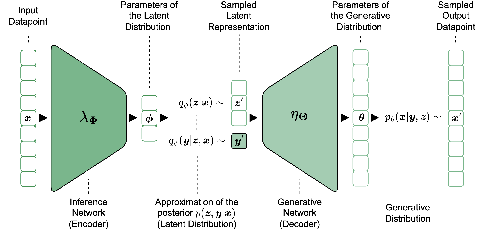

# Semi-Supervised Variational Autoencoders (SSVAE)

This repository contains code and experiments for studying Semi-Supervised Variational Autoencoders ([Narayanaswamy et al. (2017)](https://proceedings.neurips.cc/paper/2017/hash/9cb9ed4f35cf7c2f295cc2bc6f732a84-Abstract.html)), a powerful framework that unifies deep neural networks with probabilistic graphical models. SSVAEs enable the learning of disentangled representations—where distinct latent dimensions correspond to interpretable, real-world factors of variation—by leveraging both labeled and unlabeled data.



## Project Structure

```
.
├── experiments/              # Experiment scripts and analysis
│   ├── ssvae_model.py       # Core SSVAE model implementation
│   ├── experiment_pipeline.py  # Main experiments
│   ├── metrics.py           # Evaluation metrics
│   ├── utils.py             # Utility functions
│   ├── submit_alpha_exp.sh  # Job submission scripts
│   ├── submit_noise_exp.sh  # Job submission scripts
│   └── requirements.txt      # Python dependencies
├── results/                 # Experimental results and checkpoints
│   ├── checkpoints/         # Intermediate experiment results
│   ├── figures/             # Visualizations
│   ├── alpha_1_experiment.json # Experimental results
│   ├── noise_1_experiment.json # Experimental results
│   └── result_analysis.ipynb # Analysis notebook
├── data/                    # Dataset directory (MNIST)
└── docs/                    # Documentation and thesis
```

## Setup

1. Install PyTorch and dependencies:
```bash
pip install torch torchvision
```

2. Install ProbTorch (probabilistic inference library):
```bash
pip install git+https://github.com/probtorch/probtorch.git
```

3. Install additional requirements:
```bash
cd experiments
pip install -r requirements.txt
```


## License

See [LICENSE](LICENSE) file for details.